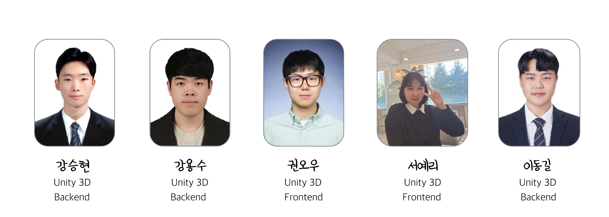

# 아이즈[iz]

>주제 : 아동학대 예방 교육 컨텐츠
>
>개발 기간 : 2021.10.11 ~ ing

## 목차

[0. 팀 소개](#0-팀-소개)

[1. 서비스 소개](#1-서비스-소개)

[2. 기술스택](#2-기술스택)

## 0. 팀 소개

## 1. 서비스 소개

> 아이의 시점으로 게임을 플레이함으로서 아동학대의 경각심을 일깨워 주기 위한 컨텐츠

### 1.1 기획 배경

##### 		1.1.1 사회적 문제 인식

​	위의 그래프와 표를 보면 알 수 있듯이 아동학대 피해 건수가 해마다 증가하고 있고, 그 중  약 80%가 부모에 의한 학대라고 알려져 있습니다.

##### 		1.1.2 법안 개정

​	최근에 있었던 안타까운 아동학대 사건들 이후로 2021년 7월 24일 '영유아 보육법 개정안'이 통과되었습니다. 이를 통해 그동안 제대로 이루어지지 않았던 아	동학대 예방 교육이 법을 통하여 시행될 수 있게 되었습니다.

### 1.2 로고

- 아이(i)
  - 알파벳 **i** 와 한글 **아이**를 의미하는 이중적 표현
  - 웃고 있지만 가슴은 뻥 뚫린 **사랑이 부족한 상태**를 의미
- 뱀(z)
  - 아이에게 위협이 되는 뱀을 형상화하며 **부모**를 의미

### 1.3 컨텐츠 소개

##### 	1.3.1 메인 스토리

​	수사관이 되어 여러가지 아동학대 사건을 풀어나가는 방식

​	

##### 	1.3.2 아이의 시선

​	VR기기를 사용하여 아이의 시선으로 아동학대 현장을 바라보며 유저의 몰입도를 높인다.

​	

## 2. 기술스택

### 2.1 백엔드

- Spring Boot
- My SQL

### 2.2 프론트엔드

- React.js

### 2.3 게임 엔진

- Unity

### 2.4 배포

- AWS EC2
- Jenkins

### 2.5 협업 Tool

- GitLab
- Notion
- Jira
- Discord
- MatterMost

